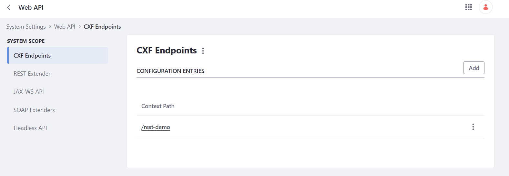

# End Points:
- http://localhost:8080/o/rest-demo 
- http://localhost:8080/o/rest-demo/morning 
- http://localhost:8080/o/rest-demo/morning/hamidul 

# Configuration Files:
- com.liferay.portal.remote.cxf.common.configuration.CXFEndpointPublisherConfiguration-cxf.properties
- com.liferay.portal.remote.rest.extender.configuration.RestExtenderConfiguration-rest.properties
# Check Points: 
After deployment validate below paths in the control panel 
- System Settings -> Web API -> CXF Endpoints
- System Settings -> Web API -> REST Extender
